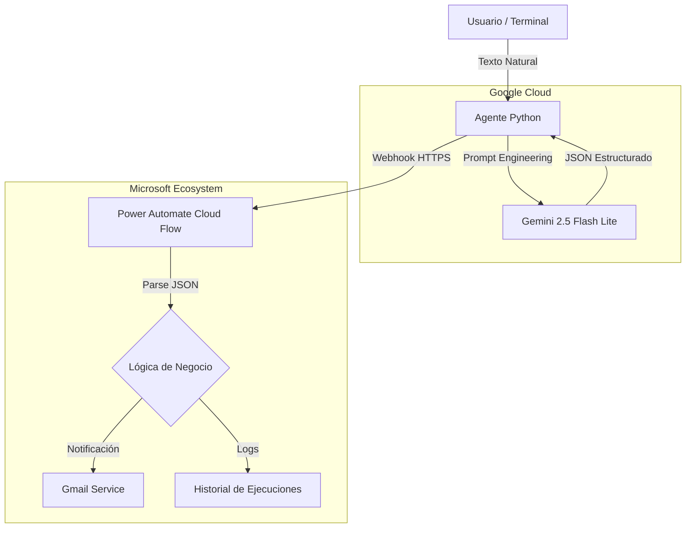

# Enterprise AI Orchestrator 🚀

**Enterprise AI Orchestrator** es una solución de infraestructura inteligente que utiliza **IA Generativa** para procesar incidentes técnicos complejos y orquestar respuestas automáticas en entornos corporativos. 


🛠️ Tecnologías y Versiones
Engine: Python 3.14.4

LLM: Google Gemini API (Modelo: gemini-2.5-flash-lite)

Orquestación: Microsoft Power Automate (HTTP Request Trigger)

Librerías de Integración:

google-generativeai: Motor de razonamiento y extracción de entidades.

requests: Cliente HTTP para comunicación con el Webhook.

python-dotenv: Gestión segura de secretos y variables de entorno.


## 🏗️ Arquitectura de Componentes



## ⚙️ Configuración del Orquestador (Power Automate)
El flujo en la nube está diseñado para ser agnóstico al cliente. La configuración técnica implementada es:

Trigger: When a HTTP request is received.

Contrato de Datos (JSON Schema):

```json
{
    "accion": "string",
    "resumen_ticket": "string",
    "prioridad": "string"
}
```
Capa de Salida: Integración con Gmail - Send email (V2). Utiliza tokens dinámicos para automatizar el asunto y cuerpo del mensaje basándose en la salida de la IA.

🚀 Instalación y Despliegue

Clonar el repositorio:

```bash
git clone https://github.com/tu-usuario/Enterprise-AI-Orchestrator.git
cd Enterprise-AI-Orchestrator
```

Configurar entorno virtual:

```bash
python -m venv .venv
./.venv/Scripts/activate  # En Windows
pip install -r requirements.txt
```

Variables de Entorno (.env):

Crea un archivo .env con tus credenciales:

```
GEMINI_API_KEY=tu_google_api_key
POWER_AUTOMATE_URL=tu_webhook_url
```
🛡️ Seguridad
Protección de Datos: Se incluye .gitignore para evitar la subida de secretos (.env) al control de versiones.

Manejo de Errores: El script incluye bloques try-except para gestionar errores de cuota (429) y conectividad de red.

Desarrollado por: Cristhian Camilo Herrera Charry
Systems Engineer & IT Architect